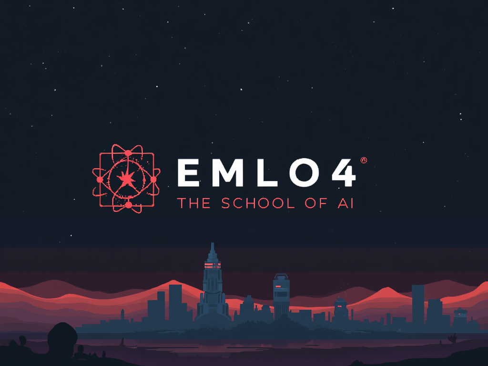

# MLOps Syllabus

## Overview
This syllabus covers the essential concepts and tools needed to implement Machine Learning Operations (MLOps). The course is designed to guide you through the best practices for managing, deploying, and maintaining machine learning models in production environments. By the end of the course, you'll be able to build, deploy, and monitor machine learning models using industry-standard tools and practices.

## Syllabus Outline

| Session | Name                                   | Description                                                                                                                       |
|---------|----------------------------------------|-----------------------------------------------------------------------------------------------------------------------------------|
| 1       | **Introduction to MLOps**              | Overview of MLOps, covering best practices and tools to manage, deploy, and maintain machine learning models in production.       |
| 2       | **Docker - I**                         | Hands-on session on creating Docker containers and introduction to core Docker concepts.                                          |
| 3       | **Docker - II**                        | Introduction to Docker Compose for multi-container applications, focusing on deploying ML applications.                           |
| 4       | **PyTorch Lightning - I**              | Overview of PyTorch Lightning for high-performance training and deployment of deep learning models.                               |
| 5       | **PyTorch Lightning - II**             | Building sophisticated ML projects using PyTorch Lightning and Hydra for seamless model creation and deployment.                  |
| 6       | **Data Version Control (DVC)**         | Managing ML data and models with DVC, including versioning, data/model management, and collaboration features.                    |
| 7       | **Experiment Tracking & Hyperparameter Optimization** | Tracking experiments with tools like Tensorboard and MLFlow, and optimizing hyperparameters using Optuna and Bayesian Optimization. |
| 8       | **AWS Crash Course**                   | Introduction to AWS services like EC2, S3, ECS, ECR, and Fargate, focusing on ML model deployment on AWS.                         |
| 9       | **Model Deployment w/ FastAPI**        | Deploying ML models using FastAPI, a modern web framework for building APIs.                                                      |
| 10      | **Model Deployment for Demos**         | Creating and sharing ML model demos with Gradio, and an overview of Model Tracing.                                                |
| 11      | **Model Deployment on Serverless**     | Overview of Serverless deployment of ML models, including AWS Lambda.                                                             |
| 12      | **Model Deployment w/ TorchServe**     | Deploying ML models using TorchServe, a PyTorch model serving library.                                                            |
| 13      | **Kubernetes - I**                     | Introduction to Kubernetes and its key concepts for container orchestration.                                                      |
| 14      | **Kubernetes - II**                    | Monitoring and configuring Kubernetes clusters for ML workloads.                                                                  |
| 15      | **Kubernetes - III**                   | Introduction to AWS EKS, deploying a FastAPI-PyTorch Kubernetes service on EKS.                                                   |
| 16      | **Kubernetes - IV**                    | EBS Volumes, ISTIO, KServe, and deploying PyTorch models on KServe.                                                               |
| 17      | **Canary Deployment & Monitoring**     | Deploying models with Canary Rollout Strategy and monitoring with Prometheus and Grafana.                                         |
| 18      | **Capstone**                           | Final project to develop and deploy an end-to-end MLOps pipeline, applying knowledge gained throughout the course.                |

## Introduction to MLOps

In the world of traditional software development, DevOps practices have made it possible to ship software to production quickly and reliably. However, Machine Learning (ML) introduces additional complexities because it involves not just code, but also data. MLOps builds on DevOps principles by adding processes and tools specifically designed for the unique challenges of managing ML systems.

### Key Concepts

1. **DevOps vs. MLOps:** While DevOps focuses on automating the integration, testing, and deployment of code, MLOps extends this to include data preprocessing, model training, and model deployment.
2. **Collaboration:** MLOps emphasizes collaboration between data scientists, engineers, and domain experts to ensure that models are effectively developed and deployed.
3. **Automation:** Automating the preprocessing of data, training of models, and deployment pipelines to ensure consistency and scalability.
4. **Version Control:** Not just for code, but also for data, models, and parameters, ensuring reproducibility and transparency.
5. **Continuous Integration and Deployment (CI/CD):** Automating model updates and deployments to production environments.
6. **Monitoring and Governance:** Regularly monitoring models to detect performance degradation, concept drift, or ethical issues.
7. **Reproducibility:** Ensuring that experiments can be easily replicated by saving all relevant code, data, and settings.

### Example: Vision and Language Models

**Vision Model Example:**
- Collaboration between data scientists and engineers to develop an image recognition system for self-driving cars.
- Automating data preprocessing tasks like image resizing and normalization.
- Version controlling the code, model architecture, and training processes.
- Setting up a CI/CD pipeline for model updates and deployment.
- Monitoring the model’s accuracy, precision, and recall in production.

**Language Model Example:**
- Collaboration with linguists to build a sentiment analysis model.
- Automating text preprocessing tasks like tokenization and stemming.
- Version controlling text preprocessing and model training processes.
- Establishing a CI/CD pipeline for seamless updates and deployment.
- Monitoring model performance and checking for data biases.

## Conclusion

This syllabus offers a comprehensive path to mastering MLOps, equipping you with the knowledge and skills needed to manage the lifecycle of machine learning models from development to deployment. By the end of this course, you will be well-prepared to implement MLOps practices in real-world projects.

