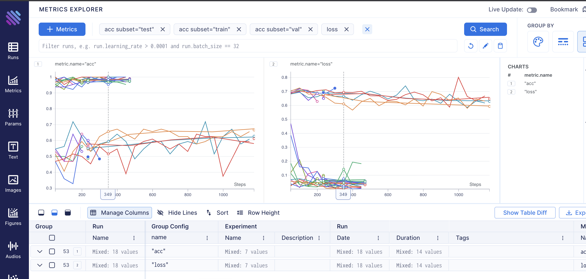
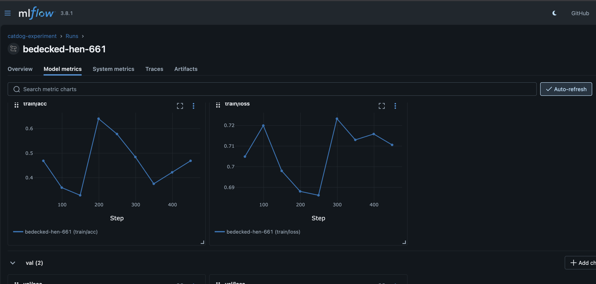
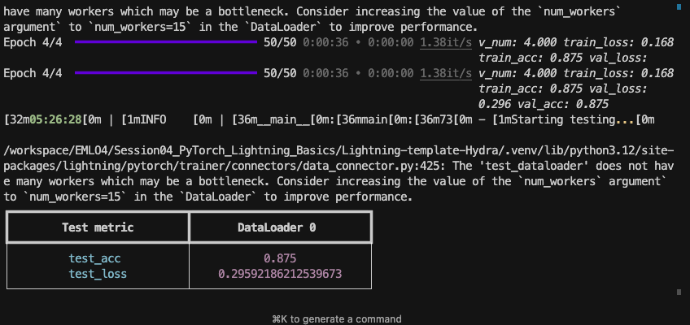

# 🐱🐕 S07: Experiment Tracking & Hyperparameter Optimization

A comprehensive ML experiment tracking project using **PyTorch Lightning**, **Hydra**, and multiple experiment trackers including **Aim**, **MLflow**, and **TensorBoard**. Features intelligent hyperparameter optimization with **Optuna**.

## 📊 Experiment Tracking Dashboards

### Aim Dashboard
Real-time experiment tracking with Aim:




### MLflow Dashboard
Experiment tracking and model registry:



## 🎯 Training Results



## 🔍 Inference Examples


---

## ✨ Features

| Feature | Description |
|---------|-------------|
| 🚀 **PyTorch Lightning** | Clean, organized training code |
| ⚙️ **Hydra** | Flexible configuration management |
| 📊 **Aim** | Real-time experiment tracking with beautiful UI |
| 📈 **MLflow** | Experiment tracking, model registry |
| 📉 **TensorBoard** | Training visualization |
| 🔄 **DVC** | Data version control with Google Drive |
| 🎲 **Optuna** | Intelligent hyperparameter optimization (TPE) |
| 🖼️ **timm** | Pre-trained models (ResNet, ViT, etc.) |

---

## 🛠️ Installation

```bash
# Clone and navigate
git clone <repository-url>
cd s07

# Install with uv (recommended)
uv sync

# Or with pip
pip install -e .
```

---

## 📁 Project Structure

```
s07/
├── configs/                    # Hydra configurations
│   ├── experiment/            # Experiment configs
│   │   ├── catdog_ex.yaml     # ResNet experiment
│   │   └── vit_sweep.yaml     # ViT architecture sweep
│   ├── hparams_search/        # Hyperparameter search configs
│   │   └── catdog_vit_optuna.yaml  # Optuna config
│   ├── logger/                # Logger configurations
│   │   ├── aim.yaml           # Aim logger
│   │   ├── mlflow.yaml        # MLflow logger
│   │   ├── tensorboard.yaml   # TensorBoard logger
│   │   ├── csv.yaml           # CSV logger
│   │   └── default.yaml       # All loggers
│   ├── model/                 # Model configs
│   ├── data/                  # Data configs
│   ├── callbacks/             # Callback configs
│   └── trainer/               # Trainer configs
├── src/
│   ├── datamodules/           # Lightning DataModules
│   ├── models/                # Model architectures
│   │   └── timm_classifier.py # timm-based classifier
│   ├── train.py               # Training script
│   └── infer.py               # Inference script
├── data/                      # Dataset (DVC tracked)
├── logs/                      # Training logs
│   ├── mlruns/               # MLflow experiments
│   └── train/runs/           # Run outputs
├── .aim/                      # Aim repository
├── pyproject.toml             # Dependencies
└── dvc.yaml                   # DVC pipeline
```

---

## 🚀 Quick Start

### Basic Training

```bash
# Train with default config (ResNet18)
uv run python src/train.py experiment=catdog_ex

# Train with custom epochs
uv run python src/train.py experiment=catdog_ex trainer.max_epochs=5

# Train with ViT model
uv run python src/train.py experiment=vit_sweep trainer.max_epochs=3
```

### Multi-Run Experiments

```bash
# Sweep learning rates
uv run python src/train.py -m experiment=catdog_ex model.lr=0.001,0.0001,0.00001

# Sweep models
uv run python src/train.py -m experiment=catdog_ex model.base_model=resnet18,resnet34

# Compare with experiment names
uv run python src/train.py -m experiment=catdog_ex \
  experiment_name="resnet18-exp","resnet34-exp" \
  model.base_model=resnet18,resnet34
```

### Optuna Hyperparameter Search

```bash
# Run intelligent hyperparameter search (10 trials)
uv run python src/train.py -m hparams_search=catdog_vit_optuna trainer.max_epochs=3

# Quick search with fewer trials
uv run python src/train.py -m hparams_search=catdog_vit_optuna \
  trainer.max_epochs=2 \
  hydra.sweeper.n_trials=5
```

---

## 📊 Experiment Tracking

### Start Aim Dashboard

```bash
# From project root
uv run aim up

# Open http://127.0.0.1:43800
```

### Start MLflow Dashboard

```bash
# From project root
uv run mlflow ui --backend-store-uri logs/mlruns

# Open http://127.0.0.1:5000
```

### Start TensorBoard

```bash
# View specific run
uv run tensorboard --logdir logs/train/runs/<timestamp>/tensorboard

# View all runs
uv run tensorboard --logdir logs/train/runs
```

---

## ⚙️ Configuration Overview

### Logger Configuration (`configs/logger/`)

| Logger | Config | Dashboard Port |
|--------|--------|----------------|
| Aim | `aim.yaml` | `:43800` |
| MLflow | `mlflow.yaml` | `:5000` |
| TensorBoard | `tensorboard.yaml` | `:6006` |
| CSV | `csv.yaml` | N/A |

### Experiment Configuration (`configs/experiment/`)

**catdog_ex.yaml** - ResNet baseline:
```yaml
experiment_name: "catdog-experiment"
model:
  base_model: "resnet18"
  num_classes: 2
  lr: 1e-3
trainer:
  max_epochs: 2
```

**vit_sweep.yaml** - ViT architecture sweep:
```yaml
experiment_name: "vit-sweep"
model:
  base_model: "vit_tiny_patch16_224"
  embed_dim: 192
  depth: 12
  num_heads: 3
```

### Optuna Config (`configs/hparams_search/catdog_vit_optuna.yaml`)

```yaml
hydra:
  sweeper:
    sampler:
      _target_: optuna.samplers.TPESampler
      n_startup_trials: 3  # Random trials before Bayesian optimization
    n_trials: 10
    direction: maximize
    
    params:
      model.lr: interval(0.00001, 0.01)
      +model.embed_dim: choice(192, 384)
      +model.depth: choice(6, 12)
```

---

## 🔄 DVC - Data Version Control

### Pull Data

```bash
# Pull data from Google Drive
dvc pull
```

### Configure Google Drive (First Time)

```bash
# Set credentials
dvc remote modify gdrive gdrive_client_id 'YOUR_CLIENT_ID'
dvc remote modify gdrive gdrive_client_secret 'YOUR_CLIENT_SECRET'

# Pull with authentication
dvc pull -r gdrive
```

---

## 📈 Metrics Logged

| Metric | Description |
|--------|-------------|
| `train/loss` | Training loss |
| `train/acc` | Training accuracy |
| `val/loss` | Validation loss |
| `val/acc` | Validation accuracy |
| `test/loss` | Test loss |
| `test/acc` | Test accuracy |

---

## 🤔 Grid Search vs Optuna

| Feature | Grid Search (`-m`) | Optuna |
|---------|-------------------|--------|
| **Strategy** | Try all combinations | Bayesian optimization (TPE) |
| **Efficiency** | Slow, exhaustive | Fast, learns from trials |
| **Pruning** | ❌ | ✅ Stop bad trials early |
| **# Trials** | All combinations | You choose (e.g., 10) |
| **Continuous params** | ❌ | ✅ `interval(0.001, 0.1)` |

---

## 🔧 Dependencies

```toml
dependencies = [
    "aim>=3.18.0",
    "hydra-core>=1.3.2",
    "hydra-optuna-sweeper>=1.2.0",
    "lightning[extra]>=2.5.1",
    "mlflow>=2.10.0",
    "timm>=1.0.15",
    "dvc>=3.65.0",
    "dvc-gdrive>=3.0.1",
]
```

---

## 📝 License

MIT License

---

## 🙏 Acknowledgments

- **PyTorch Lightning** - Training framework
- **Hydra** - Configuration management
- **Aim** - Experiment tracking
- **MLflow** - ML lifecycle management
- **Optuna** - Hyperparameter optimization
- **timm** - Pre-trained models
