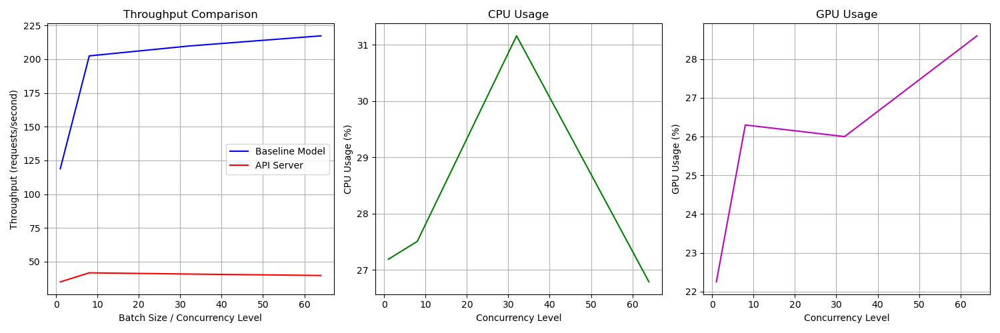

# LitServe Image Classification Deployment

## Overview
This project deploys an image classification model using LitServe, benchmarks performance, and identifies optimization opportunities.

## Model Details
- **Model**: MambaOut-Base (ImageNet-1K pretrained)
- **Framework**: LitServe + timm
- **GPU**: NVIDIA A10 (23GB VRAM)
- **Task**: ImageNet classification (1000 classes)

## Files
- `server.py` - LitServe API server (baseline, no batching)
- `test_clinet.py` - Simple client to test single image inference
- `benchmark.py` - Comprehensive benchmarking script
- `benchmark_results.png` - Performance visualization

## Baseline Performance Results

### Theoretical Maximum (Direct GPU Inference)
| Batch Size | Throughput (reqs/sec) |
|------------|----------------------|
| 1          | 118.86               |
| 8          | 202.43               |
| 32         | 209.73               |
| 64         | **217.29** ⭐        |

**Key Finding**: GPU can process up to **217 requests/sec** when batching 64 images together.

### API Server Performance (Real-world)
| Concurrency | Throughput (reqs/sec) | CPU Usage | GPU Usage |
|-------------|----------------------|-----------|-----------|
| 1           | 35.00                | 27.2%     | 22.2%     |
| 8           | **41.73** ⭐         | 27.5%     | 26.3%     |
| 32          | 40.81                | 31.2%     | 26.0%     |
| 64          | 39.75                | 26.8%     | 28.6%     |

**Key Finding**: API server achieves only **42 reqs/sec** - just **19% of theoretical maximum**.

## Performance Analysis

### 🚨 Bottleneck Identified
- **Current Throughput**: 42 reqs/sec
- **Theoretical Max**: 217 reqs/sec
- **Efficiency**: **19%** (81% performance loss!)
- **GPU Utilization**: ~26% (severely underutilized)
- **CPU Utilization**: ~27-31% (also underutilized)

### Root Cause
The server processes **one image at a time** (no batching), causing:
1. GPU sits idle between requests
2. Unable to leverage parallel processing
3. Network/decoding overhead dominates inference time

### Visualization


The plot shows:
- **Blue line**: Theoretical throughput increases with batch size
- **Red line**: API throughput remains flat (no batching)
- **Gap**: Massive performance opportunity

## Usage

### Start Server
```bash
python server.py
```

### Test Single Image
```bash
python test_clinet.py
```

### Run Benchmarks
```bash
python benchmark.py
```

## Next Steps (Optimizations)
1. ✅ **Baseline established** - 42 reqs/sec
2. ⏳ Enable batching (`max_batch_size=64`)
3. ⏳ Add multiple workers (`workers_per_device=4`)
4. ⏳ Use half-precision (bfloat16/float16)
5. ⏳ Parallel decoding with ThreadPoolExecutor
6. ⏳ Compare optimized vs baseline

**Expected improvement**: 42 → 200+ reqs/sec (5x speedup)

## Requirements
```bash
pip install litserve timm torch pillow requests psutil gpustat matplotlib numpy
```

## Assignment Goals
- [x] Deploy image classifier with LitServe
- [x] Benchmark server performance
- [x] Identify bottlenecks
- [x] Document findings with plots
- [ ] Implement optimizations incrementally
- [ ] Compare with theoretical maximum
