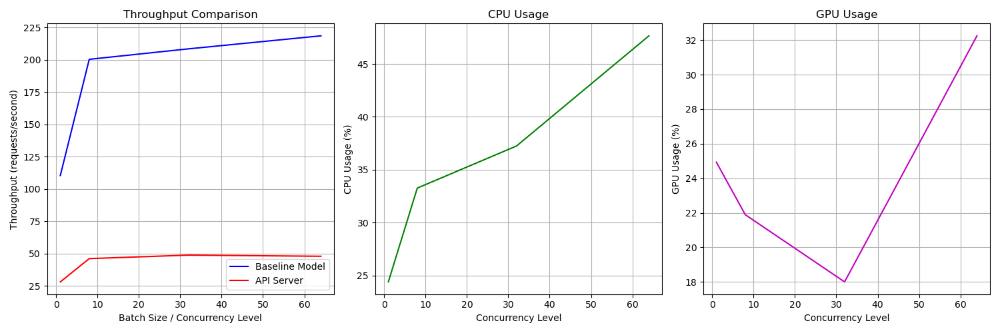

# LitServe Image Classification Deployment

## Overview
This project deploys an image classification model using LitServe, benchmarks performance, and identifies optimization opportunities.

## Model Details
- **Model**: MambaOut-Base (ImageNet-1K pretrained)
- **Framework**: LitServe + timm
- **GPU**: NVIDIA A10 (23GB VRAM)
- **Task**: ImageNet classification (1000 classes)

## Files
- `server.py` - LitServe API server (now with batching enabled)
- `test_clinet.py` - Simple client to test single image inference
- `benchmark.py` - Comprehensive benchmarking script
- `benchmark_results.png` - Baseline performance (no batching)
- `benchmark_results_batched.png` - Performance with batching enabled

## Performance Results

### Theoretical Maximum (Direct GPU Inference)
| Batch Size | Throughput (reqs/sec) |
|------------|----------------------|
| 1          | 110-119 reqs/sec     |
| 8          | 200-202 reqs/sec     |
| 32         | 208-210 reqs/sec     |
| 64         | **217-219** ⭐       |

**Key Finding**: GPU can process up to **~218 requests/sec** when batching 64 images together.

---

## Optimization Journey

### 1️⃣ Baseline (No Batching)
| Concurrency | Throughput (reqs/sec) | CPU Usage | GPU Usage |
|-------------|----------------------|-----------|-----------|
| 1           | 35.00                | 27.2%     | 22.2%     |
| 8           | **41.73** ⭐         | 27.5%     | 26.3%     |
| 32          | 40.81                | 31.2%     | 26.0%     |
| 64          | 39.75                | 26.8%     | 28.6%     |

**Results**: 
- ❌ Only **42 reqs/sec** (19% efficiency)
- ❌ GPU severely underutilized (~26%)
- ❌ Processing one image at a time


---

### 2️⃣ With Batching (max_batch_size=64, batch_timeout=0.01s)
| Concurrency | Throughput (reqs/sec) | CPU Usage | GPU Usage |
|-------------|----------------------|-----------|-----------|
| 1           | 28.02                | 24.4%     | 24.9%     |
| 8           | 46.05                | 33.3%     | 21.9%     |
| 32          | **48.75** ⭐         | 37.2%     | 18.0%     |
| 64          | 47.87                | 47.7%     | 32.2%     |

**Results**:
- ✅ Improved to **49 reqs/sec** (+16% improvement)
- ⚠️ Still only **22% efficiency** (49 vs 218 theoretical)
- ⚠️ GPU usage actually decreased in some cases
- ⚠️ Batch timeout too short to collect full batches



---

## Performance Analysis

### � Comparison Summary
| Metric | Baseline | With Batching | Improvement |
|--------|----------|---------------|-------------|
| **Best Throughput** | 42 reqs/sec | 49 reqs/sec | **+16%** 🔼 |
| **Efficiency** | 19% | 22% | +3% |
| **GPU Utilization** | ~26% | 18-32% | Inconsistent |
| **Best Concurrency** | 8 | 32 | Better scaling |

### 🔍 Why Batching Didn't Help Much?

**Issues Identified:**
1. **Batch timeout too short** (10ms) - not enough time to collect 64 requests
2. **Single worker** - can't process batches efficiently
3. **CPU bottleneck** - sequential decoding/encoding
4. **Low concurrency** - not enough simultaneous requests to form batches

### Root Cause
Even with batching enabled, the server can't form large batches because:
- Requests arrive too slowly for the 10ms timeout
- Single worker processes batches sequentially
- CPU-bound operations (base64 decode, image transforms) are not parallelized

## Usage

### Start Server
```bash
python server.py
```

### Test Single Image
```bash
python test_clinet.py
```

### Run Benchmarks
```bash
python benchmark.py
```

## Next Steps (Optimizations)
1. ✅ **Baseline established** - 42 reqs/sec
2. ✅ **Enable batching** - 49 reqs/sec (+16% improvement)
3. ⏳ Add multiple workers (`workers_per_device=4`)
4. ⏳ Increase batch timeout for better batch formation
5. ⏳ Use half-precision (bfloat16/float16)
6. ⏳ Parallel decoding with ThreadPoolExecutor
7. ⏳ Final comparison: baseline vs fully optimized

**Current**: 49 reqs/sec (22% efficiency)  
**Target**: 200+ reqs/sec (90%+ efficiency)

## Requirements
```bash
pip install litserve timm torch pillow requests psutil gpustat matplotlib numpy
```

## Assignment Goals
- [x] Deploy image classifier with LitServe
- [x] Benchmark server performance
- [x] Identify bottlenecks
- [x] Document findings with plots
- [ ] Implement optimizations incrementally
- [ ] Compare with theoretical maximum
