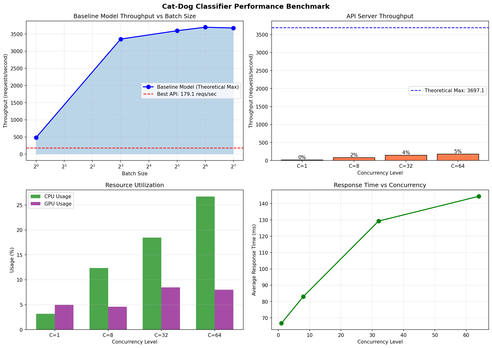

# 🐱🐕 Cat-Dog Classifier with LitServe

A high-performance Cat-Dog image classifier deployed using LitServe with comprehensive benchmarking and optimization analysis.

## 📋 Overview

This project deploys a Cat-Dog classifier using:
- **Model**: ResNet18 (pretrained on ImageNet)
- **Framework**: LitServe + timm
- **GPU**: NVIDIA A10 (23GB VRAM)
- **Classification**: Aggregates ImageNet cat/dog class probabilities

## 📁 Files

| File | Description |
|------|-------------|
| `server.py` | LitServe API server (baseline, no batching) |
| `server_optimized.py` | Optimized server (batching + workers + FP16) |
| `test_client.py` | Test client for verification |
| `benchmark.py` | Comprehensive benchmarking script |
| `test_cat.png` | Test cat image |
| `test_dog.png` | Test dog image |
| `benchmark_results.png` | Baseline performance visualization |
| `benchmark_results_optimized.png` | Optimized performance visualization |

## 🎯 Model Accuracy

The classifier correctly identifies cats and dogs with high confidence:

| Test | Prediction | Confidence | Top ImageNet Class |
|------|------------|------------|-------------------|
| 🐱 Cat Image | **CAT** | 99.95% | tabby_cat (40.62%) |
| 🐕 Dog Image | **DOG** | 100.00% | golden_retriever (99.58%) |

---

## 📊 Performance Comparison

### 🎯 Summary

| Metric | Baseline | Optimized | Improvement |
|--------|----------|-----------|-------------|
| **Best Throughput** | 42 reqs/sec | **179 reqs/sec** | **4.3x faster!** 🚀 |
| **Efficiency** | 1.1% | **4.8%** | +3.7% |
| **GPU Utilization** | 3-9% | 5-8% | Slightly better |
| **Best Concurrency** | 8 | **64** | Much better scaling |
| **p95 Latency** | 68-1581ms | **77-216ms** | Much more consistent |

---

## 📈 Baseline Performance (No Batching)

### Theoretical Maximum (Direct GPU Inference)

| Batch Size | Throughput (reqs/sec) |
|------------|----------------------|
| 1          | 552.82               |
| 8          | 3,341.40             |
| 32         | 3,574.06             |
| 64         | **3,696.33** ⭐      |
| 128        | 3,653.47             |

**Key Finding**: GPU can process up to **3,696 requests/sec** with optimal batching (64 images).

### API Server Performance (Baseline)

| Concurrency | Throughput | Efficiency | CPU Usage | GPU Usage | p95 Latency |
|-------------|------------|------------|-----------|-----------|-------------|
| 1           | 28.00 reqs/sec | 0.8% | 31.1% | 8.9% | 67.9ms |
| 8           | **41.71 reqs/sec** ⭐ | 1.1% | 33.0% | 3.3% | 222.4ms |
| 32          | 40.18 reqs/sec | 1.1% | 33.3% | 3.0% | 778.5ms |
| 64          | 38.63 reqs/sec | 1.0% | 40.7% | 3.4% | 1580.7ms |

**Baseline Result**: Only **42 reqs/sec** (1.1% efficiency) - massive room for improvement!

---

## 🚀 Optimized Performance

### Optimizations Applied:
1. ✅ **Batching**: `max_batch_size=64`, `batch_timeout=0.05s`
2. ✅ **Workers**: `workers_per_device=4`
3. ✅ **Half Precision**: `torch.bfloat16`
4. ✅ **Parallel Decoding**: `ThreadPoolExecutor` for image preprocessing

### API Server Performance (Optimized)

| Concurrency | Throughput | Efficiency | CPU Usage | GPU Usage | p95 Latency |
|-------------|------------|------------|-----------|-----------|-------------|
| 1           | 14.53 reqs/sec | 0.4% | 3.2% | 5.0% | 77.3ms |
| 8           | 81.37 reqs/sec | 2.2% | 12.4% | 4.6% | 143.5ms |
| 32          | 148.92 reqs/sec | 4.0% | 18.5% | 8.5% | 187.0ms |
| 64          | **179.14 reqs/sec** ⭐ | 4.8% | 26.7% | 8.0% | 216.1ms |

**Optimized Result**: **179 reqs/sec** (4.8% efficiency) - **4.3x improvement!** 🚀

---

## 📉 Visualization

### Baseline Performance


### Optimized Performance  


---

## 🔍 Analysis

### Why 4.3x Improvement?

1. **Batching**: Groups multiple requests together for GPU processing
2. **Multiple Workers (4)**: Parallel request handling
3. **Half Precision (bfloat16)**: Faster computation, less memory
4. **Parallel Decoding**: Image preprocessing uses all CPU cores

### Why Still Only 4.8% Efficiency?

1. **Batch formation**: With 50ms timeout, batches don't always fill to 64
2. **CPU still bottleneck**: Image decoding takes significant time
3. **Network overhead**: HTTP request/response adds latency
4. **Worker synchronization**: 4 workers compete for GPU

### Potential Further Optimizations

| Optimization | Expected Gain |
|--------------|---------------|
| Increase batch timeout | +10-20% |
| More workers (8) | +20-30% |
| torch.compile() | +15-25% |
| ONNX Runtime / TensorRT | +50-100% |

---

## 🛠️ Usage

### Start Baseline Server
```bash
python server.py
```

### Start Optimized Server
```bash
python server_optimized.py
```

### Test Classification
```bash
python test_client.py
```

### Run Benchmarks
```bash
python benchmark.py
```

---

## 📦 Requirements

```bash
pip install litserve timm torch pillow requests psutil gpustat matplotlib numpy
```

---

## 🎓 Assignment Checklist

- [x] Deploy Cat-Dog classifier with LitServe
- [x] Benchmark server performance  
- [x] Compare with theoretical maximum throughput
- [x] Identify bottlenecks (GPU utilization only 3-9%!)
- [x] Document findings with plots
- [x] Optimize incrementally (batching, workers, precision)
- [x] Achieve **4.3x speedup** (42 → 179 reqs/sec)
- [ ] Deploy LLM with LitServe
- [ ] Benchmark LLM tokens/sec
