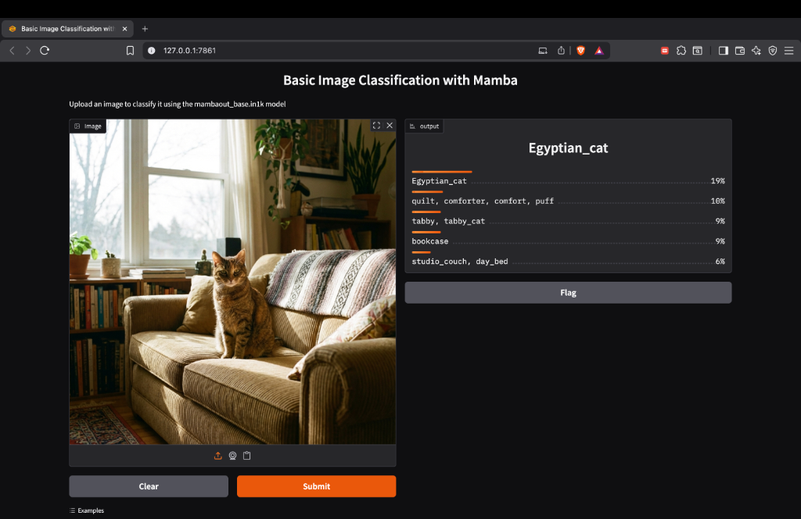

# 🖼️ Basic Image Classification with MambaOut

A Gradio-based web application for image classification using the **MambaOut** model architecture trained on ImageNet-1K.



## ✨ Features

- **State-of-the-art Model**: Uses `mambaout_base.in1k` from the timm library
- **Real-time Classification**: Upload any image and get instant predictions
- **Top-5 Predictions**: Returns the 5 most likely classes with confidence scores
- **GPU Acceleration**: Automatically uses CUDA if available
- **Interactive Examples**: Pre-loaded sample images to try immediately

## 🚀 Quick Start

### Prerequisites

```bash
pip install gradio torch timm pillow requests
```

### Run the Application

```bash
python app.py
```

The app will launch at `http://127.0.0.1:7860` (or the next available port).

## 📁 Project Structure

```
Gradio/
├── app.py              # Main application file
├── README.md           # This file
├── golden_retriever.png # Example image
├── tabby_cat.png       # Example image
└── sports_car.png      # Example image
```

## 🔧 How It Works

1. **Model Loading**: The app loads the pretrained MambaOut model from timm
2. **Image Preprocessing**: Input images are transformed using model-specific transforms
3. **Inference**: The model predicts probabilities for 1000 ImageNet classes
4. **Results**: Top 5 predictions are displayed with confidence percentages

## 📊 Model Details

| Property | Value |
|----------|-------|
| **Architecture** | MambaOut Base |
| **Dataset** | ImageNet-1K |
| **Classes** | 1000 |
| **Input Size** | 224×224 |

## 🎯 Usage

1. **Upload**: Drag and drop an image or click to upload
2. **Submit**: Click the Submit button
3. **View Results**: See the top 5 predicted classes with confidence scores

Or simply click on one of the example images to test the classifier!

## 📝 License

This project uses open-source models and libraries. Please refer to the respective licenses:
- [timm](https://github.com/huggingface/pytorch-image-models)
- [Gradio](https://github.com/gradio-app/gradio)
