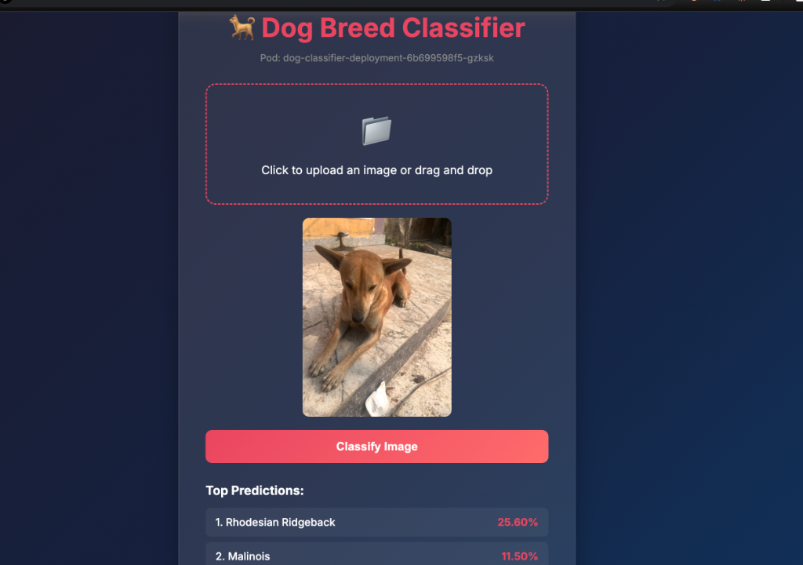

# 🐕 Dog Breed Classifier on Kubernetes

<div align="center">


**A production-ready Dog Breed Classifier deployed on Minikube Kubernetes cluster**

*Session 13 Assignment - EMLO4*

</div>

---

## 🎬 Demo

<div align="center">



*The classifier correctly identifies the dog breed with confidence scores!*

</div>

---

## ✨ Features

| Feature | Description |
|---------|-------------|
| 🚀 **FastAPI Backend** | High-performance async API with automatic OpenAPI docs |
| 🎨 **Modern UI** | Glassmorphism design with smooth animations |
| 📦 **2 Pod Replicas** | High availability with load balancing |
| 🔄 **Session Affinity** | Sticky sessions via Ingress cookies |
| ❤️ **Health Checks** | Liveness & Readiness probes configured |
| 📊 **Resource Limits** | CPU/Memory limits for stability |

---

## 📁 Project Structure

```
assignment/
├── 📄 app.py                  # FastAPI app with embedded frontend
├── 🐳 Dockerfile              # Container configuration
├── 📋 requirements.txt        # Python dependencies
├── 📖 README.md               # This file
├── 📊 kubectl_outputs.md      # Kubectl command outputs
└── ☸️  k8s/
    ├── deployment.yaml        # Deployment (2 replicas)
    ├── service.yaml           # ClusterIP Service
    └── ingress.yaml           # Nginx Ingress
```

---

## 🚀 Quick Start

### Prerequisites

- Docker installed and running
- Minikube installed
- kubectl installed

### 1️⃣ Start Minikube

```bash
# Start with Docker driver
minikube start --driver=docker

# Enable required addons
minikube addons enable ingress
minikube addons enable metrics-server

# Verify cluster
minikube status
```

### 2️⃣ Build Docker Image

```bash
# Use Minikube's Docker daemon
eval $(minikube docker-env)

# Build the image
docker build -t dog-classifier:latest .
```

### 3️⃣ Deploy to Kubernetes

```bash
# Apply all manifests
kubectl apply -f k8s/

# Watch pods come up
kubectl get pods -w
```

### 4️⃣ Access the Application

**Option A: Port Forward**
```bash
kubectl port-forward service/dog-classifier-service 8000:80
```

**Option B: Minikube Tunnel**
```bash
# Add to /etc/hosts: 127.0.0.1 dog-classifier.localhost
minikube tunnel
```

Then open:
- 🌐 **Frontend**: http://localhost:8000
- 📚 **API Docs**: http://localhost:8000/docs
- ❤️ **Health**: http://localhost:8000/health

---

## 🏗️ Architecture

```
                         ┌─────────────────────────────────┐
                         │           INTERNET              │
                         └───────────────┬─────────────────┘
                                         │
                         ┌───────────────▼─────────────────┐
                         │      🌐 Nginx Ingress           │
                         │   dog-classifier.localhost      │
                         │   (Session Affinity Enabled)    │
                         └───────────────┬─────────────────┘
                                         │
                         ┌───────────────▼─────────────────┐
                         │    ☸️  ClusterIP Service         │
                         │    dog-classifier-service       │
                         │         Port: 80                │
                         └───────────────┬─────────────────┘
                                         │
              ┌──────────────────────────┴──────────────────────────┐
              │                                                      │
    ┌─────────▼─────────┐                              ┌─────────────▼─────────┐
    │     🐳 Pod 1       │                              │      🐳 Pod 2         │
    │  dog-classifier    │                              │   dog-classifier      │
    │   Port: 8000       │                              │    Port: 8000         │
    │                    │                              │                       │
    │  ┌──────────────┐  │                              │  ┌──────────────┐     │
    │  │   FastAPI    │  │                              │  │   FastAPI    │     │
    │  │   + timm     │  │                              │  │   + timm     │     │
    │  │  ResNet50    │  │                              │  │  ResNet50    │     │
    │  └──────────────┘  │                              │  └──────────────┘     │
    └────────────────────┘                              └───────────────────────┘
```

---

## 📊 API Endpoints

| Endpoint | Method | Description |
|----------|--------|-------------|
| `/` | `GET` | 🎨 Modern web UI for image upload |
| `/docs` | `GET` | 📚 Swagger API documentation |
| `/predict` | `POST` | 🔮 Classify uploaded image |
| `/health` | `GET` | ❤️ Health check endpoint |

### Example API Request

```bash
curl -X POST "http://localhost:8000/predict" \
  -H "Content-Type: multipart/form-data" \
  -F "file=@dog.jpg"
```

### Example Response

```json
{
  "predictions": [
    {"label": "Rhodesian Ridgeback", "confidence": 0.256},
    {"label": "Malinois", "confidence": 0.115},
    {"label": "Vizsla", "confidence": 0.089}
  ],
  "pod": "dog-classifier-deployment-6b699598f5-gzksk"
}
```

---

## 🔧 Useful Commands

```bash
# View deployment
kubectl describe deployment dog-classifier-deployment

# View pod logs
kubectl logs -l app=dog-classifier -f

# Check metrics
kubectl top pod
kubectl top node

# Scale deployment
kubectl scale deployment dog-classifier-deployment --replicas=3

# Delete everything
kubectl delete -f k8s/
```

---

## 📝 Kubectl Outputs

All required kubectl command outputs are available in [`kubectl_outputs.md`](kubectl_outputs.md):

- ✅ `kubectl describe deployment`
- ✅ `kubectl describe pod`
- ✅ `kubectl describe ingress`
- ✅ `kubectl top pod`
- ✅ `kubectl top node`
- ✅ `kubectl get all -o yaml`

---

## 🛠️ Tech Stack

| Technology | Purpose |
|------------|---------|
| **FastAPI** | High-performance Python web framework |
| **timm** | PyTorch Image Models (ResNet50) |
| **Uvicorn** | ASGI server |
| **Docker** | Containerization |
| **Kubernetes** | Container orchestration |
| **Minikube** | Local K8s cluster |
| **Nginx Ingress** | Load balancing & routing |

---

## 📄 License

MIT License - Feel free to use this for learning!

---

<div align="center">

**Made with ❤️ for EMLO4 Session 13**

*Kubernetes - Introduction*

</div>
